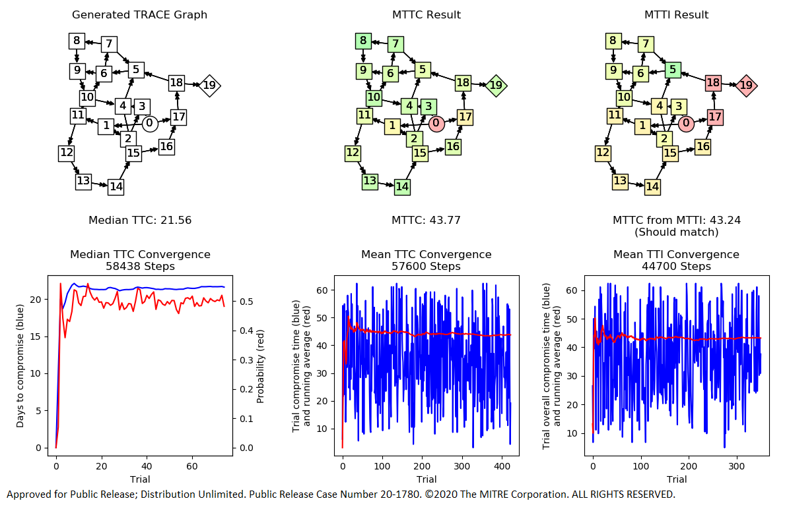
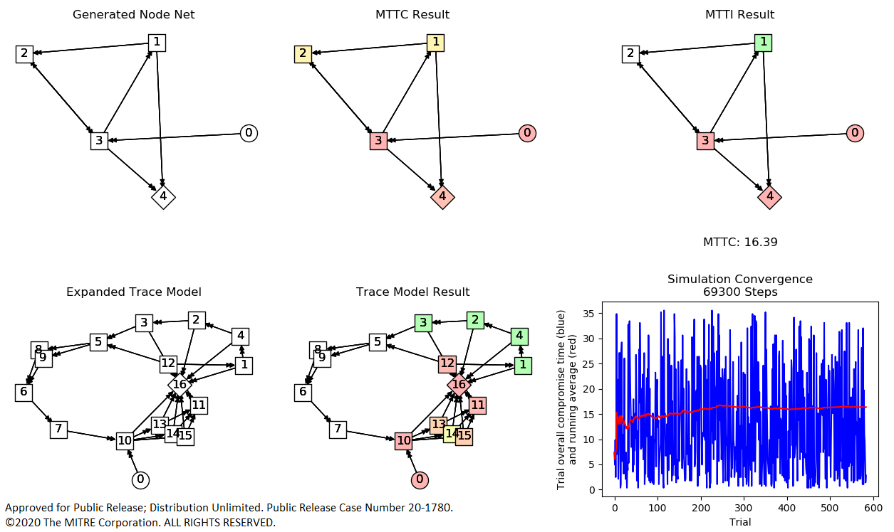

# TRACE - Traversal-driven Risk Assessment of Composite Effects

TRACE is an analysis method developed by MITRE to perform threat-based risk assessments on cyber-enabled systems. TRACE was designed specifically for systems that are a mix of traditional commercial off-the-shelf hardware and software, industrial control or cyber physical systems, and special-purpose embedded technologies.

The TRACE approach to the problem provides a means to obtain an apples-to-apples comparison across these disparate technologies, without attributing "higher risk" just because a component has more open vulnerabilities, runs a critical process or is particularly exposed to an adversary. TRACE analytics examine end-to-end attack paths, from an entry point to a mission effect. This allows TRACE to estimate mission risk based on how long it is likely to take an attacker to develop a novel means to traverse from an entry point through a system to impact operations via clandestine, non-kinetic means (cyber, supply chain or insiders).

## Description

This implementation of the TRACE analysis approach in python demonstrates the ECHO cyber threat model concept. ECHO provides an estimated time for development of a novel cyber effect based on historical observations of the rate of discovery of comparable vulnerabilities in comparable technologies.

More details on the theory and predictive mechanisms behind TRACE and ECHO are available in the papers in the docs folder. Demo analyses are provided to generate random models and show both example results as well as simulation details to support further research on this theoretical approach to this problem. The demo analyses show how the TRACE tools can be applied to other data sources and adapted to other analysis cases.

### TRACE Model Demo

A basic TRACE model is a non-conservative stochastic process graph. Much like a Markov chain model, the nodes in a TRACE graph represent conditions and edges represent probabilities of transition between those conditions. Unlike a Markov chain model, the state of the system is represented not by the current node but rather by the complete path. These paths represent the possible options available to an attacker. As TRACE edge probabilities are non-conservative, more than one outgoing edge can be traversed from a given node. This represents the possibility of more than one option being available, or even being necessary, to reach a target.

The TRACE model demo generates a random TRACE model and computes TRACE analytics over that graph. Consider this example result:



In this example, a random TRACE stochastic graph has been generated. Node 0 is identified as the only starting point, and node 19 as the only target. The median time to compromise is computed by aging the stocastic graph until it has a completed path, any completed path, from node 0 to node 19 50% of the time. The mean is computed by characterizing the cumulative distribution function sufficiently for the area above it to stabilize.

In the MTTC analytic, only the mean for the overall "any path" time is computed. This means that the MTTC values on a per-node basis reflect the mean time for a path to complete to that node from node 0. In the MTTI analytic, the mean for each node to be involved in an end-to-end path from node 0 to node 19 is shown. MTTI is the core analytic for TRACE, capturing each individual threat state contribution to risk, and highlighting which nodes are majro contributors to overall risk.

Looking at the visual in the top right of the graph, the result should seem intuitive. The nodes in the shortest path represent the most risk. However, this is not explicitly a shortest-path algorithm. Instead, these colors reflect the computer mean times for those nodes to be involved in any path, not just the shortest one. When paired with the ECHO cyber vulnerability rate prediction model, those times reflect the mean time to develop all the vulnerabilities to complete any such path based on real-world observable data.

### Node Net Model

Most systems are not natively represented by TRACE models. The node net representation in this tool is meant to provide a human-readable format for network diagrams. The ECHO threat concept model is then applied to transform those human-facing network architecture models into TRACE threat models for analysis, and transformed back to provide component-specific analytics based on the TRACE analysis result.

The node net demo generates a random node net model with ECHO components, expands it into a TRACE model and returns associated analysis. Consider this example result:



Here, an extremely simple network is generated in the top left. Not shown here is that each of these nodes is tailored as a particular type of cyber component from the ECHO catalog, which provides pre-built mappings for common components like routers and desktops to the ECHO threat concept model. This node net model is expanded into the individual threat concepts to form a TRACE model as shown on the bottom left, against which the MTTI analytic can be applied. The results are brought back to the node net, distinctly highlighting the simple shortest path from that model.

Where this analytic becomes important is for complicated networks with many paths and many diverse technologies. Using this analytic can tell you whether the additional adversary work factor to compromise a programmable logic controller is really worth more than adding a separate firewall and demilitarized zone. These analytics give you objective, real world numbers for real architecture trades.

It's easy to see that these are the obvious risks in these trivial models. Having the automated analytic lets us scale that reasoning up to systems where it isn't so obvious.

## Use

This code is designed to be a standalone "trace" package that can be imported to a purpose-built analysis tool. It consists of the following structure:

```
.
+-- demo_node_net.py
+-- demo_trace_model.py
+-- trace
    +-- __init__.py
    +-- echo.json
    +-- echo.py
    +-- generate.py
    +-- montecarlo.py
    +-- plot.py
    +-- run.py
    +-- transform.py
```

The simplest interface is to pass a TRACE node net model in the form of a JSON string to the trace.run.mtti_from_json function. The basic structure of a node net dictionary is described briefly here.

### Node Net

A node net is an adjacency list with "trace data" dictionaries to provide TRACE-specific metadata for each node and edge. The data structure is simply a dictionary with two lists, "nodes" and "edges". Note that all graphs in TRACE are directed graphs with cycles.

An example node net is as follows:
```
nn={"nodes":[{"id":0,"trace data":{"start":0}},
             {"id":1,"trace data":{"echo":"Windows_XP_Desktop"}},
             {"id":2,"trace data":{"foxtrot":"simple", "end":True}}],
    "edges":[{"id":0,"from":0,"to":1,"trace data":{"echo":"IP"}},
             {"id":1,"from":1,"to":2,"trace data":{"foxtrot":"simple"}}]}
```

The "nodes" list contains dictionaries that define the nodes:
```
    "id" : (int) or (str)
        A unique identifier used by the "edges" to link nodes together
    "trace data" : {}
        Specifies model data, should contain one of:
            "start" : (float)
                This tells the transform function this should be a node
                where attacks start after N days, 0 for immediate.
            "echo" : "simple", "catalog entry", {custom data}
                This tells the transform function this should be a cyber
                component, either using a standard model, a specific
                model from the echo.json catalog, or some customer model
                matching the echo.json dictionary format.
            "foxtrot" : "simple", {custom data}
                This tells the transform function this should be a
                functional node, part of representing how the system
                works. In this implementation, these are essentially
                all "or" gates.
        Typically, at least one "foxtrot" node should contain an "end"
            key with the boolean value True to tell the transform tool
            where to end analyses. If an end is not specified, one will
            be selected automatically.
```

The "edges" list contains dictionaries that define the links between nodes:
```
    "id" : (int) or (str)
        Each edge has a unique identifier.
    "trace data" : {}
        Specifies model data, should contain one of:
            "echo", "foxtrot" : "simple", "catalog entry", {custom data}
                This specifies the type of link, either a cyber
                interface ("echo") or a functional relationship
                ("foxtrot").
```

### Individual modules

TRACE contains several modules which perform various functions for analysis. The output of the provided demo modules are shown above, but the internal modules are discussed here in more detail.

#### run.py

This module provides an end-to-end JSON string-based analysis interface for TRACE, as discussed above.

#### generate.py

This module generates random node nets and trace models with various defined parameters, such as number of nodes and relative connectivity, for input into the Monte Carlo simulation tools.

#### transform.py

This module allows for the transformation of a node net into a trace model, and the incorporation of trace model results back into a node net. This module calls the echo module to expand individual nodes in a node net into their echo expansion, and then stitches those subgraphs back into one system-level threat graph.

#### echo.py and echo.json

This module is called by the transform module in order to apply the echo transform to specific nodes.

#### montecarlo.py

This provides the core TRACE algorithms, which are applied to trace models.

TRACE involves checking a network model for complete paths at various times throughout a simulated history. Functions provide for aging models and checking them. These are called by the run history function. These functions are used within the find time and find mean functions, which are the primary user-facing functions in the montecarlo module.

Find time and find mean run histories until the mean of the results converge on a desired parameter, such as the time for a particular probability of compromise or the mean time to compromise of the overall mission. These functions can return detailed node-specific data about the relationship of each node to the overall mission risk.

#### plot.py

This provides matplotlib plots using networkx graph plotting tools. This should be called after a plot is set up and before it is presented, which allows inclusion in either a subplot or as a standalone figure. See the demo implementations for usage.

## NOTICE

This module was solely developed under MITRE corporation internal funding project code 10AOH630-CA

Approved for Public Release; Distribution Unlimited. Public Release Case Number 20-1780. 

(c) 2020 The MITRE Corporation. ALL RIGHTS RESERVED.

Licensed under the Apache License, Version 2.0 (the "License"); you may not use this file except in compliance with the License. You may obtain a copy of the License at

http://www.apache.org/licenses/LICENSE-2.0

Unless required by applicable law or agreed to in writing, software distributed under the License is distributed on an "AS IS" BASIS, WITHOUT WARRANTIES OR CONDITIONS OF ANY KIND, either express or implied. See the License for the specific language governing permissions and limitations under the License.